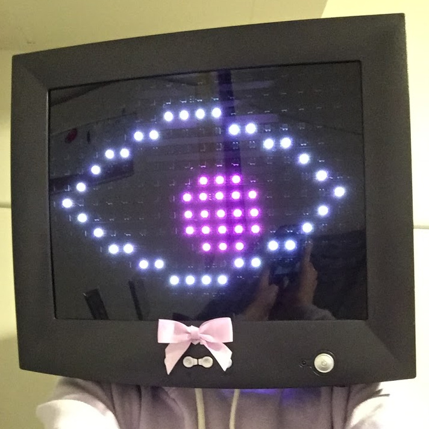
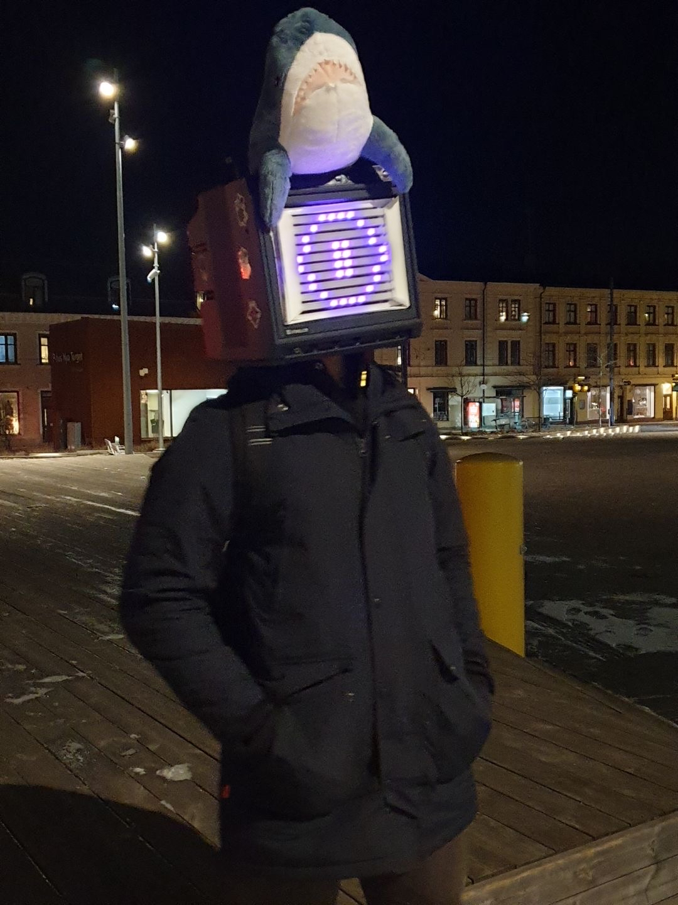
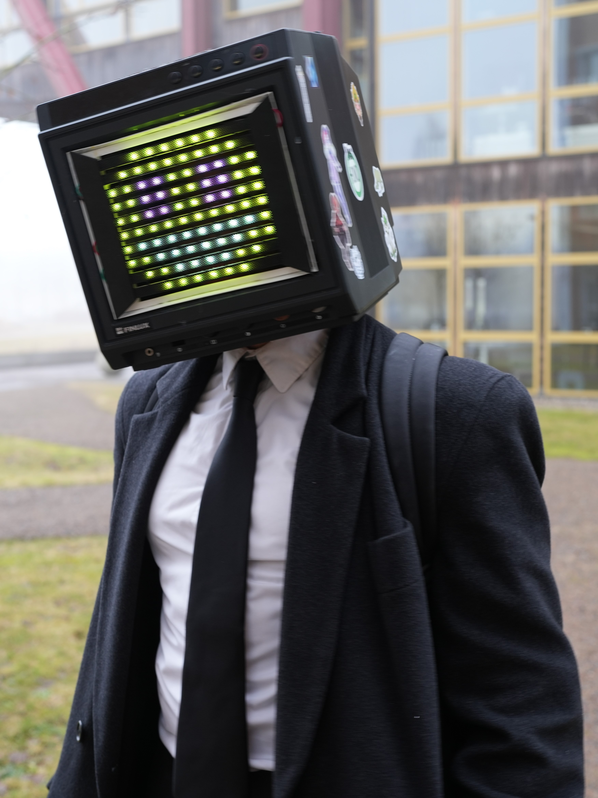

# TV Head

## What it is

This is the software behind my Tv Head cosplay made for Närcon Summer 2023 using WS2812B LED strips as a dot matrix display to show various animations and images on the face.

While I had wanted to do this cosplay for a while, the technical details were modified from [Vivian Thomas'](https://rose.systems) implementation found [here](https://rose.systems/tv_head/).

My implementation aims more to be an alternate version of their mk1 design:
<br></br>

<br></br>
- Rather than use diagonal strips, simply using thinner strips.
- Making the design more user serviceable and beginner friendly by:
  - Including fewer parts
  - Including a version written in MicroPython.
- Display pre-loaded images and animations, rather than text.
- Adjusting settings via knobs on the front of the face rather than a wired keyboard.

Version | Image
:-----------------------------------:|:------------------------------------:|
Version 1.0 |  
Version 2.0 |  
Version 3.0 | 

### Hardware structure

The wiring of the LEDs is the same as the original made by Vivian. Don't fix what's not broken. an example can be seen below:
<br></br>

<br></br>


## How it Works 

Images (either pixel art or other) are converted via the [open-cv](https://docs.opencv.org/4.x/d6/d00/tutorial_py_root.html) library into csv files containing the flattened (2D) pixel index and rgb values. These csvs are loaded onto the board where they can now be mapped onto the LED strip pixels. In this way, we retain the pixel data but save on memory.

This implementation allows having folders of sequential csv files which can be made into animations, with each file as a single frame.

**If images filenames are not zero-padded, they may not be iterated through in the right order. A quick fix for mass-renaming files to be zero-padded is the [padded_rename script](tvlib/padder.py)**


### Converting images

We move through all sub-directories in the [animations folder](animations/), converting each into a csv with a corresponding path within the [csv folder](csvs/) to the form:

```csv

index,red,green,blue
13,153,217,234
14,153,217,234
20,153,217,234

```

Where **index** here is that of the pixel the value is read from. Images are resized according to the resolution stored in [conf.toml](conf.toml) if needed. 
Alike images and frames of animations are kept within the same folder. Eg: The [Blink](/csvs/blink/) folder contains frames of a blinking animation.

Csvs are created as the change in pixels from the last frame via [Image Comparator](/dev/image_comparator.py), such that only the pixels changed between frames are rendered. This saves memory, disk space, and CPU cycles, as well as reducing flicker on larger displays from clearing, and is the default for operation.


#### Adjusting for Wiring Format

To allow for wiring similar to Vivan's implementation , we must adjust the conversion to account for the reversal of every other row in the display.
Every other row in the display is upside-down, which is the same as it simply being backwards. To account for this, we simply iterate through every other row of the image array, calling np.flip() along the row axis.

```Python

  # Reverse the order of pixels in every second row
  img[1::2, :] = flip(img[1::2, :], axis=1)

```

Now we flatten the array for easier comparison/iteration later on.

```Python

  img.reshape(-1, img.shape[-1])

```

### Global Rendering Variables

To be able to change global values such as the current brightness, channel, and speed, we keep them in a dictionary with their values.
```Python

  values = {
    "Brightness": 0.4,
    "Speed": 1,
    "Channel": 0
  }

```

### Addressing a WS2812 LED Dot-Matrix

To address the LEDS, we use the [NeoPixel](https://docs.micropython.org/en/latest/esp8266/tutorial/neopixel.html) library:

```Python

from machine import Pin
from neopixel import NeoPixel

# Pin number to address
P = 21
# Number of leds to address
N = 96

# Define display to draw to
# Display is our array of leds.
display = NeoPixel(Pin(P), N, timing = 1)

```

#### Addressing Individual LEDs

Individual LEDs are addressed by their index in the strip, and can be set to a specified RGB value with each colour channel as an element in a tuple:

```Python

# To set LED i to (0, 0, 0):
display[i] = (0, 0, 0)  

```
#### Displaying an Image

To display an image, we build the frame as a tuple of the pixel information, then send it to **animate()**.
**NOTE:** A threaded queue of frames would be preferred here, but that's for future implementation.

Firstly we get all the frames for the current animation playing:

```Python

  def read_frames(folder_path:str) -> Tuple[Tuple[Tuple[int, int, int, int]]]:
      """
      Read the frames within a given animation folder and return it as a tuple[index, r, g, b] of ints.
      """
      def assemble(filename:str) -> Tuple[Tuple[int, int, int, int]]:
          with open("/".join([folder_path, filename]), 'r', encoding = "utf-8") as csvfile:
              """
              Skip the first line so we can directly convert each line to tuple[int, int, int, int].
              """
              next(csvfile)
              frame = tuple((int(i), int(a), int(b), int(c)) for i, a, b, c in (line.rstrip('\n').rstrip('\r').split(",") for line in csvfile))
              return frame
                  
      frames = tuple(assemble(filename) for filename in listdir(folder_path) if filename.endswith('.csv'))
      
      return frames
  
```

We read the current animation index according to the value in the global dictionary. In main we call it like so:

```Python

  while RUNNING:
          animate(animations[values['Channel']])
          sleep_ms(values["Speed"]*5000)

```

To display an image, we would simply loop through a list of these pixel values and assign them to the corresponding pixel.
We skip the first item in the list because it's the header for the csv file. For LEDs which do not use RGBW but RGB, brightness is controlled by the colour value of the respective channels. (25,25,25) and (250,250,250) are the same colour, however the second one is brighter.  Remember also that light intensity is logarithmic, not linear. So here, to turn down the brightness, we simply have a brightness coefficient from 0.0 to ~0.8 as our global value changed via interrupt. This way, our final brightness is gotten by a simple multiplication:

```Python

  def animate(frames: Tuple[Tuple[Tuple[int, int, int, int]]]) -> None:
      """
      Play frames with a set time interval in ms.
      """
      global display
      b = values["Brightness"]
      for frame in frames:
          for p in frame:
              display[p[0]] = int(p[3]*b), int(p[2]*b), int(p[1]*b)
          display.write()
          sleep_ms(values["Speed"]*20)

```

We go out of our way here to pretty much always use Tuples rather than Lists for memory savings. We wont be changing the frames and their details once loaded, unless we change the channel, in which cause we scrap them all at once anyway. Image paths as well are basically constant once loaded. The immutability is a plus-side, and it allows for faster looping and less computational overhead for certain operations which become much more pronounced on a tiny MCU like a Pi Pico.
