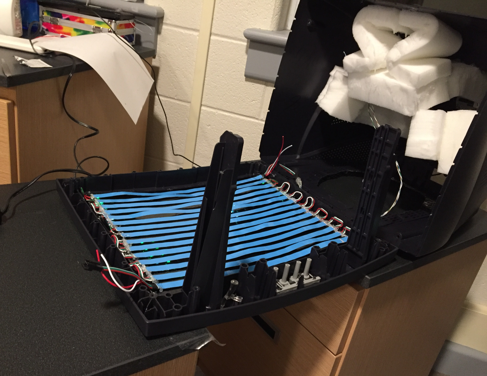

# TV Head

## What it is

This is the software behind my Tv Head cosplay made for 2023 Winter NarconS using ws2812 LED strips as a dot-matrix display to show various animations and images on the face.

While I had wanted to do this cosplay for a while, the technical details were modified from [Vivian Thomas'](https://rose.systems) implementation found [here](https://rose.systems/tv_head/).

My implementation aims more to be an alternate version of their mk1 design.

- Rather than use diagonal strips, simply using thinner strips.
- Making the design more user servicable and beginner friendly by including fewer parts and being written in MicroPython.
- Rather than focusing on displaying text, this design aims more to display pre-loaded images and animations.

### NOTE

The ability to scroll text will be implemented via simple sockets to save on memory/power. The backbone of this can be seen in the [receiver](dev/receiver.py) and [sender](upload/receiver.py).
A simple [encoder](uploads/encoder.py) is used to unpack the packets sent to the board. This is so that not only can text be sent, but potentially images/entire animations.

### Structure

Files within the [upload](/upload/) folder are meant to be uploaded to the board.
Files within [dev](/dev/) are to remain on the computer. These hold the images and image-csv [converter](/dev/image_converter.py).
Files within [utility](/utility/) are utility scripts for easy use of the ESP32 board. These are [clearing the board's memory](/utility/clear_all.py), [uploading all files](/utility/update_all.py), [updating the csvs](/utility/update_csvs.py) and [viewing the board's file structure](/utility/view_files.py).

### Materials

Rather than the Circuit Playground Express microcontroller used by Vivan in their implementation, I opted to use a [Freenove ESP32-WROVER](https://www.amazon.se/-/en/Freenove-ESP32-WROVER-Compatible-Wireless-Detailed/dp/B09BC5CNHM/ref=sr_1_25?crid=2F3ZES5T9PUGN&keywords=esp32&qid=1675219924&sprefix=esp32%2Caps%2C376&sr=8-25) because of my previous experience with one; a cloud tracking computer vision project which can be viewed [here](https://github.com/sudoDeVinci/Colour-Based-Cloud-Detection).

Listed items which are ticked indicate that they have been bought already.

- [x] [Freenove ESP32-WROVER CAM](https://www.amazon.se/-/en/Freenove-ESP32-WROVER-Compatible-Wireless-Detailed/dp/B09BC5CNHM/ref=sr_1_25?crid=2F3ZES5T9PUGN&keywords=esp32&qid=1675219924&sprefix=esp32%2Caps%2C376&sr=8-25).
- [x] [60 LED/m | 5m Length | 10mm width WS2812B LED Strip](https://www.amazon.se/-/en/dp/B08L8X7Z4P?psc=1&ref=ppx_yo2ov_dt_b_product_details)
- [x] [10 000 mAh Battery bank](https://www.amazon.se/-/en/Varta-5797610111-Power-Bank-Silver/dp/B08G91WFQR/ref=sr_1_10?crid=3BJ4IKJVQS9UX&keywords=powerbank&qid=1675220403&sprefix=power%2Bban%2Caps%2C373&sr=8-10&th=1)
- [x] [Micro USB Extension Cable](https://www.amazon.se/-/en/gp/product/B012S0ZQNU/ref=ox_sc_act_title_1?smid=ANU9KP01APNAG&psc=1)

## How it Works

Images (either pixel art or other) are converted via the [open-cv](https://docs.opencv.org/4.x/d6/d00/tutorial_py_root.html) library into csv files containing the flattened (2D) pixel index and rgb values. These csvs are loaded onto the esp32 board where they can now be mapped onto the LED strip pixels. In this way, we retain the pixel data but save on memory.

This implementation allows having folders of sequential csv files which can be made into animations, with each file as a single frame.

### Converting images

We move through all sub-directories in [dev/images](/dev/images), converting each into a csv with a corresponding path within [upload/csvs](/upload/csvs) to the form:

```csv
index,red,green,blue
13,153,217,234
14,153,217,234
20,153,217,234
```

Where **index** here is that of the pixel the value is read from. Images are resized according to the resolution stored in [res.txt](/upload/res.txt) if needed.

Alike images and frames of animations are kept within the same folder. Eg: The [upload](upload/csvs/blink) folder contains frames of a blinking animation.

### Adjusting for Wiring Format

To allow for wiring similar to Vivan's implementation seen below, we must adjust the conversion to account for the reversal of every other row in the display.



Every other row in the display is upside-down, which is the same as it simply being backwards. To account for this, we simply iterate through each row of the image during conversion, flipping every other row:

```python
# flatten image to 2d array
img_vector = img.reshape(-1, img.shape[-1])

# Flip every odd row in the array.
# "Row" as in row of pixels on the tv head.
# Assuming the wiring is as simple as possible.

# Image is sized to our dimensions so we use them
for i in range(width, (height*width), width*2):
    # Start iterating at the first odd row
    # Skip to every other odd row afterward.
    # Flip the odd row and insert it in-place
    img_vector[i:(i+10)] = np.flip(img_vector[i:(i+10)])
```

### Addressing a WS2812 LED Dot-Matrix

To address the LEDS, we use the [NeoPixel](https://docs.micropython.org/en/latest/esp8266/tutorial/neopixel.html) library:

```python
from machine import Pin
from neopixel import NeoPixel

# Pin numbers to address
p = 5
# Number of leds to address
n = 96
# Define display to draw to
# Display is our array of leds.
display = NeoPixel(Pin(p), n)
```

#### Addressing Individual LEDs

Individual LEDs are addressed by their index in the strip, and can be set to a specified RGB value with each colour channel as an element in a tuple:

```python
# To set LED i to (0, 0, 0):
display[i] = (0, 0, 0)  
```

#### Displaying an Image

To display an image, we simply loop through a csv file of flattened pixel values.

First we read a folder of csv files:

```python
def read_frames(folder_path:str) -> list[list[int]]:
  frames = []
  for filename in listdir(folder_path):
    if filename.endswith('.csv'):
      frame = []
      with open("/".join([folder_path, filename]), 'r', encoding = "utf-8") as csvfile:
        for line in csvfile:
          frame.append(line.rstrip('\n').rstrip('\r').split(","))
      frames.append(frame)
  return frames
```

This will give us a 3D array of pixel values.

To display an image, we would simply loop through a list of these pixel values and assign them to the corresponding pixel.
We skip the first item in the list because it's the header for the csv file:

```python
for p in frame[1:]:
      display[p[0]] = (p[1], p[2], p[3])
      # To have the change made, we call:
      display.write()
```

To cycle through an animation, we loop through a list of frames and do the same as above, sleeping for a specified time between each:

```python
for frame in frames:
    for p in frame[1:]:
      display[p[0]] = (p[1], p[2], p[3])
    display.write()
    sleep_ms(sleep)
```

The problem with this however, is that unless an LED is explicitly turned off, it will persist to the next frame. We must be able to  clear our frame before drawing the next one.
While setting the display to a single value can be done iteratively, the Neopixel library provides the **.fill()** for this. This allows us an easy way to clear the display:

```python
display.fill((0, 0, 0,))
display.write()
```

Drawing can therefore be done via a funtion similar to:

```python
# Play frames with a set time interval in ms.
def animate(frames_path:str, sleep:int = 300) -> None:
    frames = read_frames(frames_path)

    for frame in frames:
        display.fill((0, 0, 0))
        for p in frame[1:]:
            display[int(p[0])] = (int(p[1]), int(p[2]), int(p[3]))
        display.write()
        sleep_ms(sleep)
```
