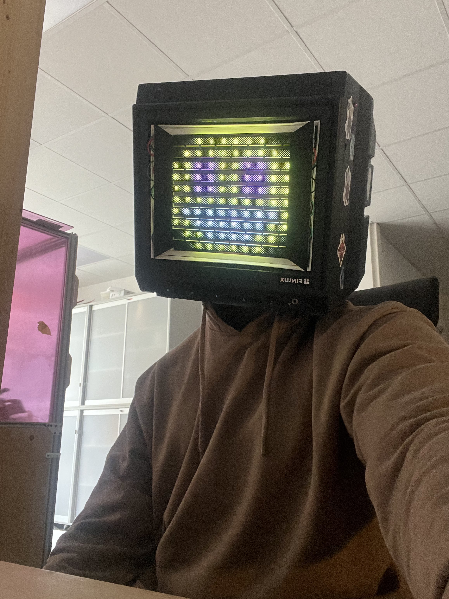

# TV Head

## What it is

This is the software behind my Tv Head coslay made for Närcon Summer 2023 using WS2812 LED strips as a dot matrix diplay to show various animations and images on the face.

While I had wanted to do this cosplay for a while, the technical details were modified from [Vivian Thomas'](https://rose.systems) implementation found [here](https://rose.systems/tv_head/).

My implementation aims more to be an alternate version of their mk1 design:
  

  
- Rather than use diagonal strips, simply using thinner strips.
- Making the design more user servicable and beginner friendly by:
  - Including fewer parts
  - Being written in MicroPython.
- Rather than focusing on displaying text, this design aims to display pre-loaded images and animations.
- Rather than adjusting settings via a physical keyboard connection, a small webserver, as well as knobs on the front of the face can be used.

The finished version 1.0 was done in time for Närcon Winter 2023 and can be seen here:
  

  

The finished version 2.0 was done in time for Närcon Summer 2023 and can be seen here:
  

  

### Repo Structure

Files within the [upload](/upload/) folder are meant to be uploaded to the board.
Files within [dev](/dev/) are to remain on the computer. These hold the images and image-csv [converter](/dev/image_comparator.py).Files within [utility](/utility/) are utility scripts for easy use of any ESP32 board if you prefer that. These are: 
- [clearing the board's memory](/utility/clear_all.py) 
- [uploading all files](/utility/update_all.py) 
- [updating the csvs](/utility/update_csvs.py) 
- [viewing the board's file structure](/utility/view_files.py)

### Hardware structure

The wiring of the leds is the same as the original made by Vivian. Don't fix what's not broken. an example can be seen below:
  

  

The basics of the entire system are shown here, with the only change being the use of linear encoders instead of potentiometers:
  

  

### Materials

Rather than the Circuit Playground Express microcontroller used by Vivan in their implementation, I opted to use a [Rasberry Pi Pico](https://www.amazon.se/-/en/SC0915-Raspberry-Pi-Pico/dp/B09KVB8LVR/ref=sr_1_5?crid=DJA3JLK27B3X&keywords=pi+pico&qid=1677125232&sprefix=pi+pico%2Caps%2C171&sr=8-5) because of my previous experience with micropython; a cloud tracking computer vision project which can be viewed [here](https://github.com/sudoDeVinci/Colour-Based-Cloud-Detection).

Listed items which are ticked indicate that they have been bought already.

- [x] [Rasberry Pi Pico](https://www.amazon.se/-/en/SC0915-Raspberry-Pi-Pico/dp/B09KVB8LVR/ref=sr_1_5?crid=DJA3JLK27B3X&keywords=pi+pico&qid=1677125232&sprefix=pi+pico%2Caps%2C171&sr=8-5)
- [x] [60 LED/m | 5m Length | 10mm width WS2812B LED Strip](https://www.amazon.se/-/en/dp/B08L8X7Z4P?psc=1&ref=ppx_yo2ov_dt_b_product_details)
- [x] [10 000 mAh Battery bank](https://www.amazon.se/-/en/Varta-5797610111-Power-Bank-Silver/dp/B08G91WFQR/ref=sr_1_10?crid=3BJ4IKJVQS9UX&keywords=powerbank&qid=1675220403&sprefix=power%2Bban%2Caps%2C373&sr=8-10&th=1)
- [x] [Micro USB Extension Cable](https://www.amazon.se/-/en/gp/product/B012S0ZQNU/ref=ox_sc_act_title_1?smid=ANU9KP01APNAG&psc=1)