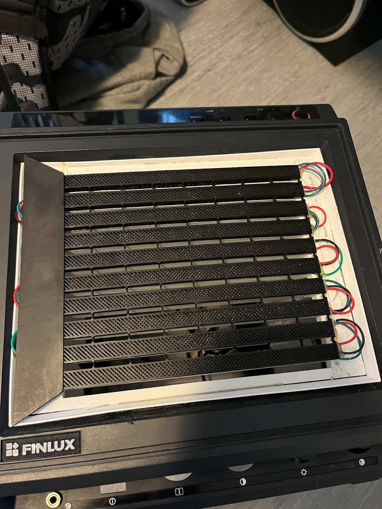

# TV Head
[](https://github.com/sudoDeVinci/TV-head/actions/workflows/python-app.yml)
## What it is

This is the software behind my Tv Head cosplay made for Närcon Summer 2023 using WS2812B LED strips as a dot matrix display to show various animations and images on the face.

While I had wanted to do this cosplay for a while, the technical details were modified from [Vivian Thomas'](https://rose.systems) implementation found [here](https://rose.systems/tv_head/).

My implementation aimed more to be an alternate version of their mk1 design, but evolved into a creature of its own:

Front view | Inside
:-----------------------------------:|:------------------------------------:|
 |

<br>

- Rather than use diagonal strips, simply using thinner strips.
- Making the design more user serviceable and beginner friendly by:
  - Including fewer parts
  - Including a version written in MicroPython.
- Display pre-loaded images and animations, rather than text.
- Adjusting settings via knobs on the front of the face rather than a wired keyboard.
- Add movement-based animation feedback.

<br>

Version | Finished | Face-Plate
:-----------------------------------:|:------------------------------------:|:------------------------------------:|
Version 1.0 |  | 
Version 2.0 |  | 
Version 3.0 |  | 
Version 3.5 |  | 

<br>

### Hardware structure

The wiring of the LEDs is the same as the original made by Vivian. Don't fix what's not broken. An example can be seen below:

<br>


<br>

## How it Works 

Images (either pixel art or other) are converted via the [Open-CV](https://docs.opencv.org/4.x/d6/d00/tutorial_py_root.html) library into either JSON or CSV files containing the flattened (2D) pixel index and rgb values. These are loaded onto the board where they can now be mapped onto the LED strip pixels. In this way, we retain the pixel data but save on memory.

This implementation allows a couple of ways of playing these frames on the device:
1. Having folders of sequential csv files which can be made into animations, with each file as a single frame.
2. Having a single json file which contains all frames and also metadata.

**If images filenames are not zero-padded, they may not be iterated through in the right order. A quick fix for mass-renaming files to be zero-padded is the [padded_rename script](tvlib/padder.py)**


### Converting images

We move through all sub-directories in the [animations folder](animations/), 
converting each into a json file with the corresponding path within the [json folder](json/) to the form:
```json
{
  "frames": [
    [
      [0, 1, 240, 255],
      [1, 0, 242, 255],
      [2, 0, 242, 255], 
      [3, 0, 242, 255], 
      [4, 1, 240, 255]
    ],
    [...],
    [...],
    [...]
  ]
}
```


Alternatively is converting each into a csv with a corresponding path within the [csv folder](csvs/) to the form:

```csv
index,red,green,blue
13,153,217,234
14,153,217,234
20,153,217,234
```

Where **index** here is that of the pixel the value is read from. Images are resized according to the resolution stored in [conf.toml](conf.toml) if needed. 
Alike images and frames of animations are kept within the same folder. Eg: The [Blink](/csvs/blink/) folder contains frames of a blinking animation.

Csvs are created as the change in pixels from the last frame via the [Image Comparator](tvlib/comparator.py), such that only the pixels changed between frames are rendered. This saves memory, disk space, and compute, as well as reducing flicker on larger displays from clearing, and is the default for operation.


#### Adjusting for Wiring Format

To allow for wiring similar to Vivan's implementation , we must adjust the conversion to account for the reversal of every other row in the display.
Every other row in the display is upside-down, which is the same as it simply being backwards. To account for this, we simply iterate through every other row of the image array, calling np.flip() along the row axis.

```Python

  # Reverse the order of pixels in every second row
  img[1::2, :] = flip(img[1::2, :], axis=1)

```

Now we flatten the array for easier comparison/iteration later on.

```Python

  img.reshape(-1, img.shape[-1])

```

#### Adjusting for rotated or flipped images/displays
In the second version of the display, made to fit the more robotic head, the design has been flipped and therefore the image pipeline must occomodate flipped/rotated displays.
Luckily, OpenCV has provided us with the functions needed to flips and rotate images quickly.
To enable us to pass the values of these transofrmations in an understandable way throughout the pipeline, we map the rotations and flips onto two separate Enums. The values of these are partials, given by the functools package.  

For each of these enums, we have 4 essential parts:

1. A function that maps the rotations/flips onto a function which will be called via the Enum value.

```python
def mapped_rotate(image: MatLike | UMat, rot: Rotation) -> MatLike | UMat:
    return rotate(image, rot)
```

2. A function that does nothing but takes in the correct args for the base case.
```python
def nothing(image: MatLike | UMat, rot: Rotation = None, flip: Flip = None) -> MatLike | UMat:
    return image
```

3. The Enum with the partial mappings.
```python
from enum import Enum
from cv2 import ROTATE_90_COUNTERCLOCKWISE, ROTATE_180, ROTATE_90_CLOCKWISE, flip, rotate, imread, imshow, waitKey
from functools import partial

class Rotation(Enum):
    ROTATE_90 = partial(mapped_rotate, rot = ROTATE_90_COUNTERCLOCKWISE)
    ROTATE_180 = partial(mapped_rotate, rot = ROTATE_180)
    ROTATE_270 = partial(mapped_rotate, rot = ROTATE_90_CLOCKWISE)
    NONE = partial(nothing, rot = None, flip = None)
```

4. Dunder methods within our enums which allow us to call these partials, and also return a default enum value.

```python
class Rotation(Enum):
    ROTATE_90 = partial(mapped_rotate, rot = ROTATE_90_COUNTERCLOCKWISE)
    ROTATE_180 = partial(mapped_rotate, rot = ROTATE_180)
    ROTATE_270 = partial(mapped_rotate, rot = ROTATE_90_CLOCKWISE)
    NONE = partial(nothing, rot = None, flip = None)
  
    def _missing_(cls, value: Self):
          return cls.NONE

      def __call__(self, *args):
          return self.value(*args)
```

### Global Rendering Variables

To be able to change global values such as the current brightness, channel, and speed, we keep them in a dictionary with their values.

```Python

  # Variables to define constant labels
  BRIGHTNESS: str = const("Brightness")
  CHANNEL: str = const("Channel")
  SPEED: str = const("Speed")

  RENDER_VALUES: Dict[str, int | float] = {
    BRIGHTNESS: 0.1,
    SPEED: 1,
    CHANNEL: 1
}

```

### Addressing a WS2812 LED Dot-Matrix

To address the LEDS, we use the [NeoPixel](https://docs.micropython.org/en/latest/esp8266/tutorial/neopixel.html) library:

```Python

  from machine import Pin
  from neopixel import NeoPixel

  # Pin number to address
  P: int = const(16)
  # Number of leds to address
  N: int = const(100)

  # Define display to draw to
  # Display is our array of leds.
  display = NeoPixel(Pin(P), N, timing = 1)

```

#### Addressing Individual LEDs

Individual LEDs are addressed by their index in the strip, and can be set to a specified RGB value with each colour channel as an element in a tuple:

```Python

  # To set LED i to (0, 0, 0):
  display[i] = (0, 0, 0)  

```
#### Displaying an Image

To display an image, we build the frame as a tuple of the pixel information, then send it to **animate()**.
**NOTE:** A threaded queue of frames would be preferred here, but that's for future implementation.

Firstly we get all the frames for the current animation playing:

```Python

  def read_frames(folder_path:str) -> Tuple[Tuple[Tuple[int, int, int, int]]]:
    """
    Read the frames within a given animation folder and return it as a tuple[index, r, g, b] of ints.
    """
    def assemble(filename:str) -> Tuple[Tuple[int, int, int, int]]:
        frame: Tuple[Tuple[int, int, int, int]] = None
        with open(filename, 'r', encoding = "utf-8") as csvfile:
            """
            Skip the first line so we can directly convert each line to tuple[int, int, int, int].
            """
            next(csvfile)
            frame = tuple((int(i), int(a), int(b), int(c)) for i, a, b, c in (line.rstrip('\n').rstrip('\r').split(",") for line in csvfile))
            
        return frame
                
    frames = tuple(assemble("/".join([folder_path, filename])) for filename in listdir(folder_path) if filename.endswith('.csv'))
    
    return frames
  
```

We create two tasks for scheduling, the rendering on screen and the reading of sensors such as gyroscopes. Both reading the sensors and rendering require frequent delays, meainng switching between these tasks can be smoothly done. In main we call it like so:

```Python

  async def main() -> None:
    global RENDER_VALUES
    global animations
    global CHANNEL
    
    asyncio.create_task(animate())
    asyncio.create_task(read_gyro())
    while True: await asyncio.sleep_ms(10_000_000)

```

To display an image, we would simply loop through a list of these pixel values and assign them to the corresponding pixel.
For LEDs which do not use RGBW but RGB, brightness is controlled by the colour value of the respective channels. (25,25,25) and (250,250,250) are the same colour, however the second one is brighter.  Remember also that light intensity is logarithmic, not linear. So here, to turn down the brightness, we simply have a brightness coefficient from 0.0 to ~0.8 as our global value changed via interrupt. This way, our final brightness is gotten by a simple multiplication. Since we have sensors and other peripherals changing our rendering values, we check upon each loop iteration if there is a change. If there is, we return True, whereas if no change, we return False.:

```Python
async def render(frames: Tuple[Tuple[Tuple[int, int, int, int]]]) -> bool:
    b = RENDER_VALUES[BRIGHTNESS]
    ch = RENDER_VALUES[CHANNEL]
    for frame in frames:
        for p in frame:
            if RENDER_VALUES[CHANNEL] != ch or RENDER_VALUES[BRIGHTNESS] != b:
                return 1
            display[p[0]] = int(p[3]*b), int(p[2]*b), int(p[1]*b)
        display.write()
        await asyncio.sleep_ms(int(RENDER_VALUES[SPEED]*100))
    return 0
```

Animating the screen also involves the pauses between animation however. During this pause, rendering values like BRIGHTNESS and CHANNEL may once again be changed via peripherals and must be checked. This means we have a loop, checking for changes and sleeping upon iteration rather than a single long sleep.

```Python
async def animate() -> None:
    global RENDER_VALUES
    global CHANNEL
    global BRIGHTNESS
    
    """
    Play frames with a set time interval in ms.
    """
    
    
    while True:
        b = RENDER_VALUES[BRIGHTNESS]
        ch = RENDER_VALUES[CHANNEL]
        
        current_frames = animations[RENDER_VALUES[CHANNEL]]
    
        render_value = await render(current_frames)
        if render_value:
            clear()
            continue
        
        for i in range(100):
            if RENDER_VALUES[CHANNEL] != ch or RENDER_VALUES[BRIGHTNESS] != b:
                clear()
                break
            await asyncio.sleep_ms(int(RENDER_VALUES[SPEED]*50))
```


We go out of our way here to pretty much always use Tuples rather than Lists for memory savings. We wont be changing the frames and their details once loaded. Image paths as well are constant once loaded. The immutability is a plus-side, and it allows for faster looping and less computational overhead for certain operations which become much more pronounced on a tiny MCU like a Pi Pico.

In the main function, it's a very simple flow. Clear the screen, begin animation task and begin sensor polling task.

```Python

  async def main() -> None:
    global RENDER_VALUES
    global animations
    global CHANNEL
    
    clear()
    asyncio.create_task(animate())
    asyncio.create_task(read_gyro())
    while True: await asyncio.sleep_ms(10_000_000)
      
```

### Knobs for Changing Values

Manual value control are done via Rotary Controllers. This is the simplest way and allows a more retro look for analog knobs. We modified code from [here](https://github.com/MikeTeachman/micropython-rotary), mostly small changes. The [RotaryIRQ class](/onboard/Pico/rotaryirq.py) wraps the rotary class, and provides a nicer interface from usage.
The way that the rotary encoder class works is that callbacks are triggered every time the encoder is rotated.The callbacks are registered via the .add_listener() method, added to a list, and take no arguments. The callbacks are registered as hardware interrupts, and therefore will interrupt already running code. It's best to keep these short and only do a few things in them.
<br>
Create one like so:

```python
ROTARYIRQ_BRIGHTNESS = RotaryIRQ(pin_num_clk = 18,
                                pin_num_dt = 19,
                                label = BRIGHTNESS,
                                min_val = 0,
                                max_val = 50,
                                reverse = False,
                                range_mode = Rotary.RANGE_WRAP
```

Then a simple callback would be to set the global brightness value based on the value() of the rotary controller.

```python
def rot_irq() -> None:
    global ROTARYIRQ_BRIGHTNESS
    global RENDER_VALUES
    global animation_amount
        
    RENDER_VALUES[ROTARYIRQ_BRIGHTNESS.label()] = (ROTARYIRQ_BRIGHTNESS.value() / 50)

```

Then we would add the listener to the list of callbacks to trigger during the hardware interrupt.

```Python

ROTARYIRQ_BRIGHTNESS.add_listener(rot_irq)

```

And finally, set and initial value for the object to avoid jumping values during the first movements.

```
ROTARYIRQ_BRIGHTNESS.set(value = RENDER_VALUES[ROTARYIRQ_BRIGHTNESS.label()])
```
