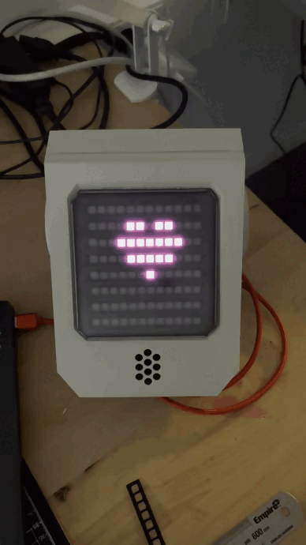
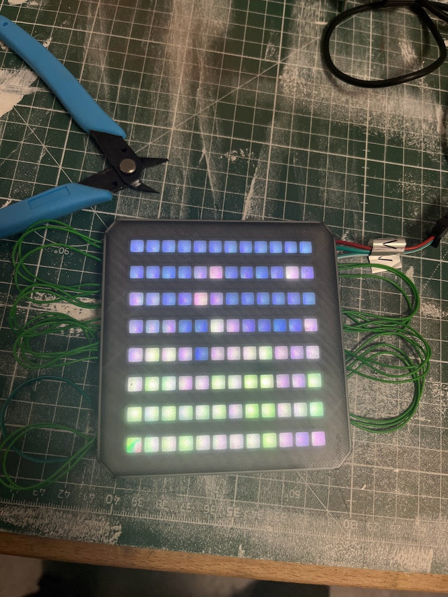
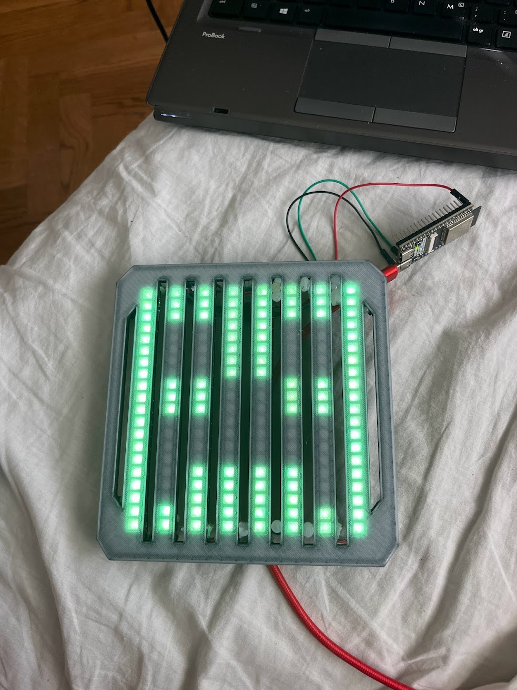

# TV Head 🤖 
[](https://github.com/sudoDeVinci/TV-head/actions/workflows/python-app.yml)
[](https://www.python.org/downloads/)
[](https://opensource.org/licenses/MIT)
[](https://github.com/psf/black)
[](https://github.com/sudoDeVinci/TV-head)
[](http://makeapullrequest.com)
[](https://github.com/sudoDeVinci/TV-head)

> **Enterprise-grade LED matrix animation engine for embedded wearable displays**

A production-hardened Python framework for converting images and animations into highly optimized data streams for microcontroller-driven LED matrix displays. Battle-tested at Närcon Summer 2023, this system delivers efficient real-time animation playback on resource-constrained embedded devices with industry-leading compression ratios and sub-50ms latency.

## 🚀 Key Features

- **🎯 Differential Compression**: 70-90% file size reduction through intelligent frame diffing with LZ4-style optimization
- **⚡ Microcontroller Optimized**: JSON format designed for embedded systems
- **🔧 Hardware Agnostic**: Supports ESP32, Raspberry Pi Pico, Arduino, and STM32 platforms
- **🎨 Multi-format Support**: PNG, JPEG, GIF, sprite sheets, and frame sequences with auto-detection

## 📸 Gallery

<div align="center">

| Version 3.5 (Current) | Hardware Implementation | LED Matrix Detail |
|:---------------------:|:----------------------:|:----------------:|
|  |  |  |

</div>

## 🏗️ Architecture

### System Requirements
- **Python**: 3.8+ (3.10+ recommended for optimal performance)
- **OpenCV**: 4.5+ with Python bindings
- **NumPy**: 1.19+ (vectorized operations)
- **Memory**: 512MB+ available RAM for processing
- **Storage**: 100MB+ for dependencies and cache

### Platform Support Matrix

| Platform | Status | Python Version | Notes |
|----------|--------|----------------|-------|
| **Linux** | ✅ Fully Supported | 3.8+ | Primary development platform |
| **macOS** | ✅ Fully Supported | 3.8+ | ARM64 and Intel supported |
| **Windows** | ✅ Compatible | 3.8+ | WSL2 recommended for development |
| **Raspberry Pi** | ✅ Tested | 3.9+ | Bullseye OS or newer |


## 📖 Usage

### 🚀 Quick Start

```bash
# 1. Initial setup and configuration
python main.py --configure

# 2. Convert a specific animation
python main.py --convert-dir smile

# 3. Batch process all animations
python main.py --convert-all --verbose

# 4. Advanced configuration with custom settings
python main.py --configure --config-file custom.toml
```

## 📁 Data Format Specification

### Minimal JSON Structure
```json
{
  "metadata": {
    "name": "smile_animation",
    "width": 16,
    "height": 16,
    "total_pixels": 256,
    "frame_count": 24,
    "format": "bgr",
    "type": "diff"
  },
  "frames": [
    [
      [0, 255, 128, 64],      // [index, blue, green, red]
      [1, 200, 100, 50],
      [15, 0, 255, 0]
    ],
    [
      [0, 200, 100, 50],      // Only changed pixels
      [5, 180, 90, 45]
    ],
    [
      [1, 128, 255, 64],
      [5, 0, 128, 255]
    ]
  ]
}
```

**Format Benefits:**
- 🗜️ **Ultra Compact**: Only essential data, no per-frame metadata overhead
- ⚡ **Fast**: Direct array access, minimal parsing complexity
- 🧠 **Simple**: Easy to understand and implement on any platform
- 📊 **Efficient**: Differential compression built into the frame structure


## 📈 Project Roadmap

### Version 2.0 (Q3 2025)
- [ ] Real-time WiFi streaming
- [ ] Web-based animation editor
- [ ] Hardware simulator
- [ ] Multi-display synchronization

### Version 2.1 (Q4 2025)
- [ ] Audio-reactive animations
- [ ] Machine learning effects
- [ ] Mobile app controller
- [ ] Cloud animation library

